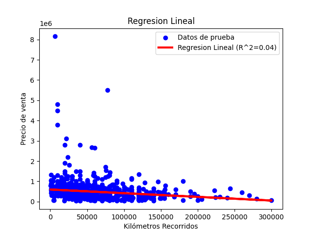

# Tarea 6: Regresiones, clustering y servicios web

## Ejecución del programa:
### Guía para Instalar el Módulo Kaggle y Descargar el esperado CSV desde la Plataforma:
> La utilización del módulo Kaggle se debe a la imposibilidad de emplear el módulo Request. Esto se debe a que el CSV deseado proviene de la plataforma de Kaggle, que requiere credenciales de usuario para acceder a la información mediante código, necesitando así un archivo JSON de autenticación. Request no admite esta funcionalidad.

1. Registrarse en la plataforma ***Kaggle***: [https://www.kaggle.com/account/login?phase=startRegisterTab&returnUrl=%2Fdatasets%2Fakshaydattatraykhare%2Fcar-details-dataset%3Fresource%3Ddownload](https://www.kaggle.com/account/login?phase=startRegisterTab&returnUrl=%2Fdatasets%2Fakshaydattatraykhare%2Fcar-details-dataset%3Fresource%3Ddownload)

2. Después de registrarse en la página, diríjase a la sección de Account > Settings, ubique la opción denominada API y haga clic en el botón Create New Token.

3. Se le descargará un archivo llamado `kaggle.json`:

```json
{"username":"yehoh04","key":"69ceef2a00ddf62b207243e30d4947c1"}
```

> Tiene la libertad de utilizar el `kaggle.json` mostrado si lo desea.

4. Alguna terminal de su computadora ejecute el siguiente comando (asegurese de tener python instalado):

```go
...\ie0217\Tareas\TAREA_SEIS> pip install kaggle
```

5. Una vez instalado el modulo Kaggle de python, se le generará una carpeta con el nombre de `.kaggle`. Ahí es donde se debe ubicar el `kaggle.json`.


```go
C:\Users\user_example\.kaggle
```

En este caso `user_example` sería el nombre de usuario de su computadora.

6. Continue con lo solicitado en la siguiente sección de este documento.


### Ejecución de los archivos del programa: 
Para ejecutar los archivos del programa, asegúrese de estar en el directorio del repositorio en su computadora y escriba el comando `make`, como se muestra a continuación:

```go
...\ie0217\Tareas\TAREA_SEIS> make
```

## Análisis de los resultados obtenidos:
> - Las gráficas generadas durante la ejecución del código están disponibles para su visualización.
> - Los datos utilizados para el análisis se han obtenido de [https://www.kaggle.com/datasets/akshaydattatraykhare/car-details-dataset?resource=download](https://www.kaggle.com/datasets/akshaydattatraykhare/car-details-dataset?resource=download).
> - Estos datos han sido sometidos a un proceso de limpieza para eliminar duplicados y valores faltantes.


### Análisis del año de venta en relación con el precio de los vehículos:
Como se apreciará en los gráficos de regresión, el año de fabricación del vehículo puede tener un impacto notable en su precio. Sin embargo, este efecto tiende a ser más relevante en vehículos considerados raros o de colección, dependiendo del modelo.

#### Regresión lineal simple:


```go
Error cuadrático medio (MSE) en regresión lineal simple: 267737137875.10327
Coeficiente de determinación (R^2) en regresión lineal simple: 0.16886241633651733
Error absoluto medio (MAE) en regresión lineal simple: 236626.94069403742
```

Observando tanto la recta de regresión lineal como las métricas asociadas, es evidente que el modelo de regresión presenta un rendimiento deficiente para los datos analizados. Esto se refleja en el valor elevado del Error Cuadrático Medio (MSE), indicando una gran discrepancia entre las predicciones del modelo y los valores reales. Además, el coeficiente de determinación \(R^2\) sugiere un ajuste muy limitado.

Este desempeño deficiente puede atribuirse a la naturaleza de los datos utilizados, que abarcan vehículos de colección junto con vehículos estándar. Como resultado, la gráfica de dispersión exhibe puntos dispersos en un mismo año, lo que dificulta la capacidad del modelo para capturar una tendencia lineal coherente.

Otro factor a considerar es que el análisis solo se centra en el año de venta del vehículo, sin tener en cuenta el año de fabricación. La inclusión del año de fabricación permitiría explorar cómo la antigüedad del vehículo puede influir de manera más directa en su precio.

#### Regresión no lineal polinómica (Grado 2):


```go
Error cuadrático medio (MSE) en regresión no lineal: 262241713485.8416
Coeficiente de determinación (R^2) en regresión no lineal: 0.18592188662273124
Error absoluto medio (MAE) en regresión no lineal: 224614.88677245678
```

Los resultados obtenidos mediante la regresión no lineal revelan las mismas limitaciones del modelo con respecto a estos datos específicos. Aunque se observa una ligera mejora en cada métrica, el coeficiente de determinación \(R^2\) aumenta marginalmente de 0.17 a 0.19.

El código implementado tiene la capacidad de realizar regresiones no lineales con distintos grados para intentar generar ecuaciones polinómicas con un coeficiente de determinación (\(R^2\)) más alto. Sin embargo, se optó por limitar el grado a 2 debido a que no se observó una mejora significativa incluso al aumentar el grado a 5. De hecho, el rendimiento del modelo comenzó a deteriorarse con grados superiores.

#### Obtención de la cantidad de clusters:


Se determinó el número óptimo de clusters utilizando tanto el Método del Codo como el Método de la Silueta.

En el Método del Codo, la gráfica exhibe el mayor cambio en \(K = 3\), lo que sugiere que esta cantidad de clusters podría ser la más adecuada para el modelo. Este hallazgo se ve respaldado por el Método de la Silueta, que indica que con \(K = 3\) se obtiene el coeficiente más alto, superando significativamente a las otras opciones. Por lo tanto, ambos métodos llegan a la misma conclusión: \(K = 3\) clusters es la mejor elección.

Es importante destacar que, aunque el Método de la Silueta suele ser más efectivo y claro para determinar el número óptimo de clusters, requiere un tiempo de ejecución considerablemente mayor en el código.

#### Gráfica de KMeans:


En esta gráfica se muestran los 3 clusters, cada uno representado con un color distinto, que el algoritmo KMeans decidió separar.

Al observar la distribución de los grupos de clusters, podemos determinar lo siguiente:

1. Cluster morado: incluye vehículos cuyo año de venta se correlaciona con un precio bajo.
2. Cluster amarillo: comprende vehículos cuyo año de venta se correlaciona con un precio medio.
3. Cluster turquesa: engloba vehículos cuyo año de venta se correlaciona con un precio alto o muy alto.

Por lo tanto, este método de agrupación ha dividido el conjunto en función del monto del precio y el año de venta.

### Análisis de los kilómetros recorridos en relación con el precio de los vehículos:
De igual manera, como se muestra en los gráficos de regresión, se observa que un mayor kilometraje en un vehículo tiende a devaluar su precio.

#### Regresión lineal simple:


```go
Error cuadrático medio (MSE) en regresión lineal simple: 307988220482.47314
Coeficiente de determinación (R^2) en regresión lineal simple: 0.043910802213658284
Error absoluto medio (MAE) en regresión lineal simple: 292401.46063219226
```

En este caso, las métricas y la recta de regresión muestran un desempeño aún más deficiente que en la sección de Análisis anterior. Se observa un MSE y un MAE significativamente grandes, lo que indica una discrepancia considerable entre las predicciones del modelo y los datos reales. Además, el coeficiente de determinación (\(R^2\)) se aproxima a 0, lo que sugiere que el modelo tiene una capacidad predictiva muy limitada.

A pesar de esto, la tendencia decreciente en la recta de predicciones ofrece un atisbo de cómo el valor de los vehículos (precio de venta) tiende a disminuir levemente con un mayor kilometraje. Sin embargo, el principal desafío radica en la diversidad de modelos y marcas de vehículos en el conjunto de datos, lo que dificulta determinar si el kilometraje es el único factor influyente en la disminución del precio de venta. Por ejemplo, la historia de cada vehículo puede variar considerablemente: incluso si tiene un alto kilometraje, el hecho de que haya sido propiedad de una celebridad podría aumentar su valor independientemente de la distancia recorrida. 

Esta variedad de circunstancias individuales contribuye a la irregularidad en los datos y complica la creación de un modelo predictivo preciso.

#### Regresión no lineal polinómica (Grado 2):


```go
Error cuadrático medio (MSE) en regresión no lineal: 303669170312.9427
Coeficiente de determinación (R^2) en regresión no lineal: 0.057318448796103705
Error absoluto medio (MAE) en regresión no lineal: 289585.5996081953
```

De manera similar, como era de esperar, el empleo de una regresión no lineal con datos dispersos conlleva una mejora, aunque mínima. Sin embargo, incluso con esta mejora, el modelo sigue sin ofrecer una utilidad significativa para un análisis fiable. El coeficiente de determinación (\(R^2\)) solo experimenta un leve incremento, pasando de 0.04 a 0.06, mientras que los errores MSE y MAE disminuyen ligeramente.

#### Obtención de la cantidad de clusters:


Se determinó el número óptimo de clusters utilizando tanto el Método del Codo como el Método de la Silueta.

Ambos métodos llegan a la misma conclusión: \(K = 3\) clusters es la mejor elección. Esto refleja una consistencia con los hallazgos anteriores en los cuales se analizó el año de venta de los vehículos, incluso en la misma forma de mostrar que esta cantidad de clusters es significativamente mejor.


#### Gráfica de KMeans:


Se muestra la gráfica con los 3 clusters, cada uno representado con un color distinto, que el algoritmo KMeans decidió separar.

Al observar la distribución de los grupos de clusters, podemos determinar lo siguiente:

1. Cluster morado: los vehiculos con menor precio de venta.
2. Cluster amarillo: los vehiculos con un medio precio de venta.
3. Cluster turquesa: los vehiculos con un alto precio de venta.

Por lo que se puede determinar, que el kilometraje no parece ser tan relevante para la agrupación.

## Parte teórica:
### Regresión:
1. ¿Qué es la regresión lineal y cómo se diferencia de la regresión no lineal?

Una regresión lineal es un método aleatorio que trata de modelar la relación entre una variable dependiente y una o más variables independientes mediante el ajuste de una ecuación lineal ***y = a + m\*b***. Mientras que una regresión no lineal utiliza funciones no lineales para ajustar los datos, usualmente de carácter polinomial, permitiendo capturar relaciones más complejas y curvas entre variables.

2. ¿Qué son los coeficientes de regresión y qué información proporcionan sobre la relación entre las variables?

Los coeficientes de regresión (β) son los valores que multiplican a las variables independientes (X) en la ecuación lineal [1]. En el siguiente ejemplo se  una regresión lineal simple:

$$
Y_{i}= β_{0} + β_{1}X_{i}
$$

Estos coeficientes indican el efecto promedio que tiene cada variable independiente sobre la variable dependiente, manteniendo constantes al resto de variables [1]. En el siguiente ejemplo de una regresión lineal múltiple:

$$
Y_{i}= β_{0} + β_{1}X_{1} + β_{2}X_{1}
$$

El coeficiente β1 representa el cambio esperado en y por cada unidad que aumenta X1, asumiendo que X2 se mantiene fijo.

3. ¿Qué es el error cuadrático medio (MSE) y cómo se utiliza para evaluar la precisión de un modelo de regresión?

El error cuadrático medio (MSE) es una medida de la diferencia entre los valores reales y los valores predichos por un modelo de regresión; y se calcula como el promedio de los cuadrados de las diferencias entre cada valor real y su valor predicho.

Este se utiliza para evaluar la precisión de un modelo de regresión, de forma que cuanto menor sea el MSE, mejor será el ajuste del modelo a los datos. También se puede utilizar para comparar diferentes modelos de regresión y elegir el que tenga el menor.

4. ¿Cuál es la diferencia entre regresión simple y regresión múltiple y cuándo se utiliza cada una?

La principal diferencia entre una regresión simple y regresión múltiple es el número de variables independientes que se utilizan para predecir la variable dependiente. La regresión simple usa una sola variable independiente, y si tiene más de una variable independiente se considera regresión múltiple.

La regresión simple se utiliza cuando se quiere estudiar la relación entre una variable dependiente y una sola variable independiente, y la regresión múltiple se utiliza cuando se quiere estudiar la relación entre una variable dependiente y varias variables independientes, o cuando se quiere controlar el efecto de otras variables que pueden influir en la variable dependiente, siendo este más completo pero más complejo.


### Clustering:
1. ¿Qué es el clustering y cuál es su objetivo principal en el análisis de datos?

Es una técnica de aprendizaje no supervisado que cuya función es agrupar en clusters (grupos) un conjunto de datos, de forma que los datos dentro de cada grupo sean similares entre si y diferentes a otros grupos.

Su objetico principal es encontrar patrones mediante el análisis de estos datos, estructuras o segmentos ocultos en los datos, que pueden ser usados en diferentes campos como el Marketing, Medicina, Internet, etc.

2. Describa brevemente los algoritmos K-Means y DBSCAN y cómo funcionan.

Algoritmo **K-Means**: requiere que el usuario especifique el número de clusters (k) e inicializar k puntos aleatorios como centrodes, luego, itera los siguientes pasos hasta que los centroides converjan o se alcance un número máximo de iteraciones: asignar cada observación al centroide más cercano, y recalcular los centroides como el promedio de las observaciones asignadas a cada grupo [2].

Algoritmo **K-DBSCAN**: no requiere que el usuario especifique el número de grupos, sino que los detecta automáticamente en función de la densidad de los datos. 

Se necesita dos parámetros: el radio (eps) y el número mínimo de puntos (minPts) para considerar una zona como densa. Luego, clasifica cada observación en uno de los siguientes tipos: punto núcleo (core point), si tiene al menos minPts puntos dentro de su radio; punto frontera (border point), si no es un punto núcleo pero tiene al menos un punto núcleo dentro de su radio; y punto ruido (noise point), si no es ni núcleo ni frontera. Finalmente, se asigna cada punto núcleo y sus puntos frontera alcanzables al mismo grupo, y deja los puntos ruido sin asignar [3].

3. ¿Qué es la inercia en el contexto del clustering y cómo se utiliza para evaluar la calidad de un agrupamiento?

La inercia es una medida de la dispersión de los datos dentro de los grupos, que se calcula como la suma de las distancias al cuadrado de cada observación a su centroide asignado. Se utiliza para evaluar la calidad de un agrupamiento, de forma que cuanto menor sea la inercia, mejor será el ajuste de los datos a los grupos, ya que indica que las observaciones están más cerca de sus centroides. 

Sin embargo, la inercia no es una medida absoluta, sino que depende del número de grupos, la escala de los datos y la medida de distancia utilizada.

4. ¿Qué son los centroides y cómo se utilizan en el algoritmo K-Means?

Los centroides son los puntos centrales de cada grupo, que representan el promedio o la posición media de las observaciones asignadas a ese grupo. Se utilizan en el algoritmo K-Means para definir y actualizar los grupos, de forma que cada observación se asigna al centroide más cercano según alguna medida de distancia, y cada centroide se recalcula como el promedio de las observaciones asignadas a su grupo.

5. Escriba la diferencia entre datos estructurados y no estructurados para análisis de datos.

Los datos estructurados son aquellos que tienen una estructura predefinida y esperada, que se almacenan en tablas, filas y columnas, y que se pueden consultar y analizar fácilmente. Los datos estructurados suelen provenir de fuentes como bases de datos relacionales, hojas de cálculo, formularios o transacciones [4]. 

Por otro lado, los datos no estructurados son aquellos que no tienen una estructura definida ni un formato específico, que se almacenan en formatos diversos y muy diferentes, y que requieren de procesos complejos para poder analizar su contenido y extraer información valiosa de ellos [4].

### Paquetes en Python (`__init__.py`):
1. ¿Qué es un paquete en Python y cómo se diferencia de un módulo?

Un paquete es un directorio que contiene varios módulos relacionados que pueden ser: archivos con definiciones y declaraciones de objetos como funciones, clases, variables, etc [5]. 

Un paquete se diferencia de un módulo en que este último es un archivo individual, mientras que el primero es una colección de archivos organizados jerárquicamente [5].

2. ¿Cuál es la función del archivo `__init__.py` dentro de un paquete de Python?

La función del archivo __init__.py dentro de un paquete es indicar al intérprete que el directorio es un paquete y no carpeta sin más. Además, este puede contener código de inicialización del paquete, como importar algunos módulos, definir algunas variables o funciones, o establecer la variable __all__ [6].

3. ¿Cómo se importa un módulo o función desde un paquete en Python?

Para importar un módulo o función desde un paquete en Python se utiliza la sintaxis `from paquete.modulo import funcion` o `import paquete.modulo.funcion`, donde paquete es el nombre del directorio que contiene el archivo `__init__.py`, modulo es el nombre del archivo de Python sin la extensión **.py**, y **funcion** es el nombre de la función definida en el módulo. Si el paquete tiene subpaquetes, se debe indicar la ruta completa separando los nombres con puntos [6].

4. ¿Qué es la variable `__all__` en el archivo `__init__.py` y cuál es su propósito?

La variable `__all__` en el archivo `__init__.py` es una lista de cadenas que define los nombres de los módulos que se deben importar cuando se usa la instrucción from paquete import *. Esta variable solo afecta a la instrucción `from paquete import *`, los demás nombres que no estén en `__all__` siguen siendo accesibles desde fuera del paquete y se pueden importar con from paquete import nombre [7].

5. ¿Cuál es la ventaja de organizar el código en paquetes y módulos en Python?

La ventaja de organizar el código en paquetes y módulos en Python es que permite modularizar, reutilizar y distribuir el código de forma más eficiente y sencilla. 

Al usar paquetes y módulos se puede dividir el código en unidades, facilitando su mantenimiento y comprensión. También se puede aprovechar el código ya escrito en otros módulos o paquetes, evitando la repetición y el desperdicio de recursos.

### Python HTTP y Servicios Web (API):
1. ¿Qué es una API y cuál es su función en el contexto de los servicios web?

Una API (Application Programming Interface) es un conjunto de reglas, protocolos y herramientas que permiten a diferentes aplicaciones comunicarse e intercambiar datos entre sí [8]. En el contexto de los servicios web, una API es una forma de acceder a los recursos y funcionalidades de un servidor web a través de una URL y un formato de datos estandarizado, como JSON.

2. ¿Cuál es la diferencia entre una API RESTful y una API SOAP?

Una API RESTful utiliza los verbos HTTP (GET, POST, PUT, DELETE) para definir las operaciones sobre los recursos, y suele usar JSON como formato de datos; siendo más simple, flexible y escalable que una API SOAP [9].

Una API SOAP utiliza el formato XML para definir un lenguaje común (SOAP) y un contrato (WSDL) para describir los servicios web y sus mensajes; siendo más compleja, rígida y segura que una API RESTful, y suele usar el verbo HTTP POST para todas las operaciones [10].

3. Describa los pasos básicos para consumir una API utilizando Python.
    - Importar el módulo requests, que facilita el envío y la recepción de peticiones HTTP en Python.
    - Construir la URL de la API, añadiendo los parámetros necesarios según la documentación de la API.
    - Enviar la petición HTTP con el método adecuado (get, post, put, delete) y obtener la respuesta del servidor.
    - Analizar la respuesta, que suele estar en formato JSON o XML, y extraer la información deseada.
    - Manejar los posibles errores o excepciones que puedan ocurrir durante el proceso.

4. ¿Qué es la autenticación de API y por qué es importante?

La autenticación de API es el proceso de verificar la identidad y los permisos de un cliente que quiere acceder a una API. La autenticación es importante para proteger los datos y recursos del servidor web, evitar el acceso no autorizado o malicioso, y controlar el uso y el rendimiento de la API [11]. 

5. ¿Cuál es el papel de los verbos HTTP (GET, POST, PUT, DELETE) en las solicitudes a una API y HTTP?

Estos verbos son los métodos que se utilizan para indicar la acción que se desea realizar sobre un recurso en una API o en un servidor web [12]. Cada verbo HTTP tiene una semántica y unas implicaciones diferentes. Se pueden definir de la siguiente forma [12]:

- ***GET:*** Se usa para solicitar una representación de un recurso, sin modificarlo ni afectarlo. Es un método seguro, idempotente y cacheable.
- ***POST:*** Se usa para enviar datos a un recurso, creando o modificando una entidad. Es un método no seguro, no idempotente y no cacheable.
- ***PUT:*** Se usa para reemplazar o actualizar un recurso con los datos enviados. Es un método no seguro, idempotente y no cacheable.
- ***DELETE:*** Se usa para eliminar un recurso. Es un método no seguro, idempotente y no cacheable.

## Bibliografía

[1] J. A. Rodrigo, “Regresión lineal con python,” Ciencia de datos, Oct. 2020. [En línea]. Disponible: https://cienciadedatos.net/documentos/py10-regresion-lineal-python.html. [Accedido: 11- Feb- 2024]

[2] T. Sequeira, “Clustering en Python: Implementando K-means paso a paso,” Medium, 2024. [En línea]. Disponible: https://thiagosequeira.medium.com/clustering-en-python-implementando-k-means-paso-a-paso-9d19875dfabc. [Accedido: 11- Feb- 2024]

[3] Exponentis, Ejemplo de uso de DBSCAN en Python para detección de outliers, Exponentis, 10 Mar. 2020. [En línea]. Disponible: http://exponentis.es/ejemplo-de-uso-de-dbscan-en-python-para-deteccion-de-outliers. [Accedido: 11- Feb- 2024]

[4] “Tipos de datos: datos estructurados, semiestructurados y no estructurados,” Blogs de IMF, Jun. 2020. [En línea]. Disponible: https://blogs.imf-formacion.com/blog/tecnologia/tipos-de-datos-datos-estructurados-semiestructurados-y-no-estructurados-202006/. [Accedido: 11- Feb- 2024]

[5] PythonDiario, Módulos y Paquetes en Python, PythonDiario, 26 Jan. 2019. [En línea]. Disponible: https://pythondiario.com/2019/01/modulos-y-paquetes-en-python.html. [Accedido: 11- Feb- 2024]

[6] PythonDiario, init.py en python - Que es y como funciona, PythonDiario, 22 Jun. 2013. [En línea]. Disponible: https://pythondiario.com/2013/06/initpy-en-python-que-es-y-como-funciona.html. [Accedido: 11- Feb- 2024]

[7] DelftStack, init.py in Python, DelftStack, 2024. [En línea]. Disponible: https://www.delftstack.com/es/howto/python/init.py-in-python/. [Accedido: 11- Feb- 2024]

[8] J. Van Schooneveld, Python and REST APIs: Interacting With Web Services, Real Python, 2024. [En línea]. Disponible: https://realpython.com/api-integration-in-python/. [Accedido: 11- Feb- 2024]

[9] “Cómo crear una API RESTful con Python y Flask,” imaginaformacion.com. [En línea]. Disponible: https://imaginaformacion.com/tutoriales/crear-api-restful-python-flask. [Accedido: 11- Feb- 2024]

[10] “Trabajar con un servicio web basado en SOAP usando Python,” ICHI.PRO. [En línea]. Disponible: https://ichi.pro/es/trabajar-con-un-servicio-web-basado-en-soap-usando-python-157587208518764.[Accedido: 11- Feb- 2024]

[11] Afilnet, API de Autenticación para Python, Afilnet, 2024. [En línea]. Disponible: https://www.afilnet.com/es/autenticacion/api/python/. [Accedido: 11- Feb- 2024]

[12] “Métodos de petición HTTP - HTTP | MDN,” MDN Web Docs, 2023. [En línea]. Disponible: https://developer.mozilla.org/es/docs/Web/HTTP/Methods. [Accedido: 11- Feb- 2024]